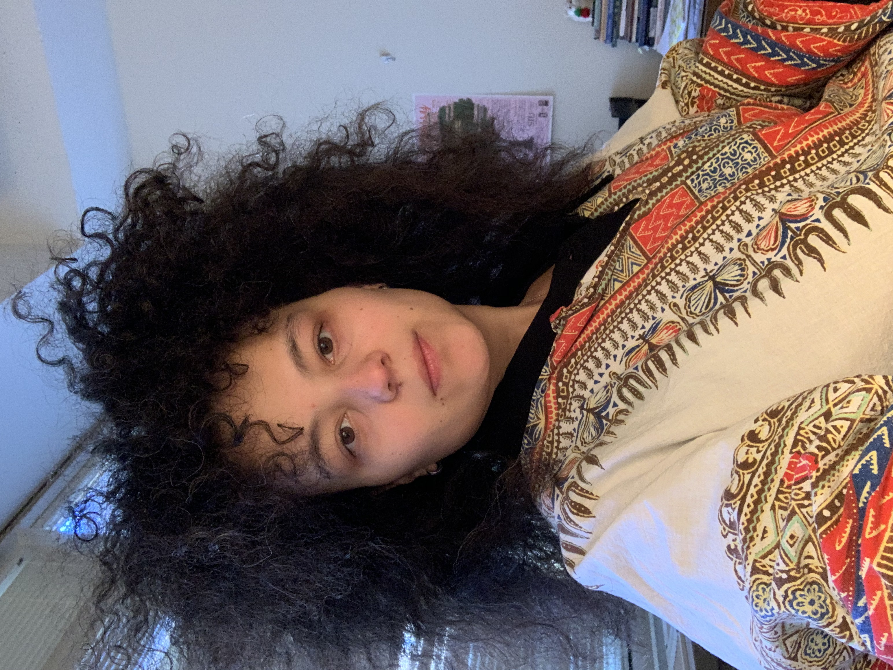

 

Cordera is a two-year Pushcart Prize-nominated poet. She is a proud black writer and creole poet, descending from African, Indigenous, and French/Spanish ancestors. Her poetry can be found or is forthcoming in Xavier Review, and Auburn Avenue. Currently, she is an MFA candidate at Southern Illinois University in Carbondale and Poetry Editor at The New Southern Fugitives.

 

 